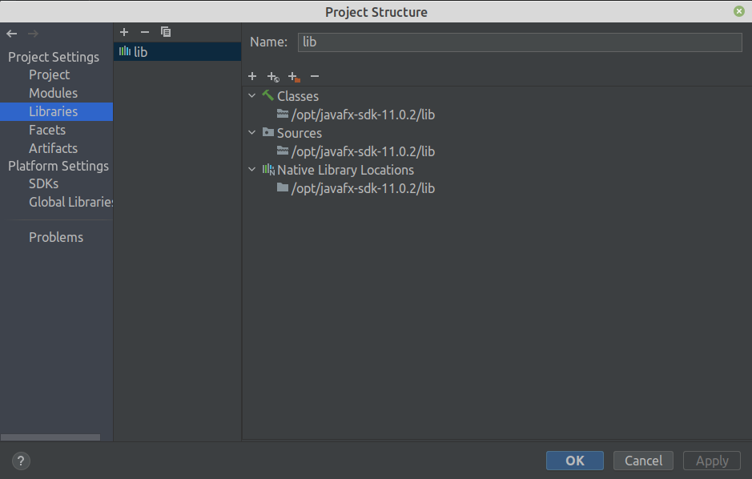
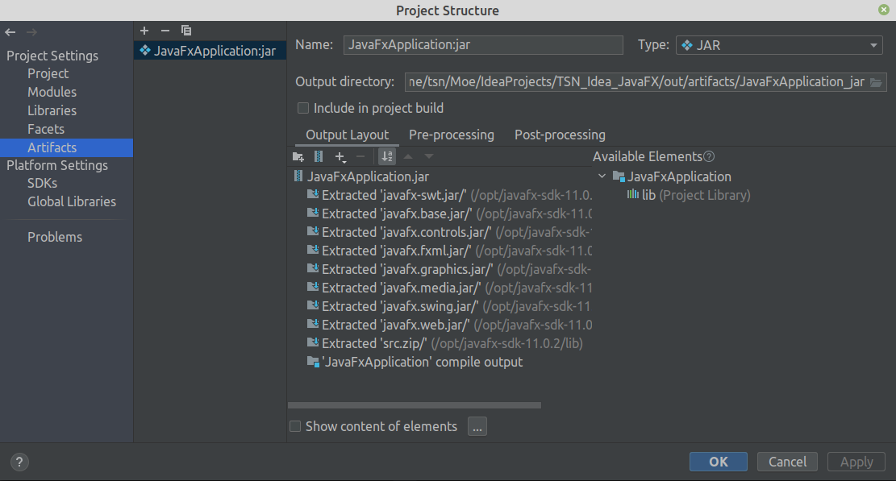
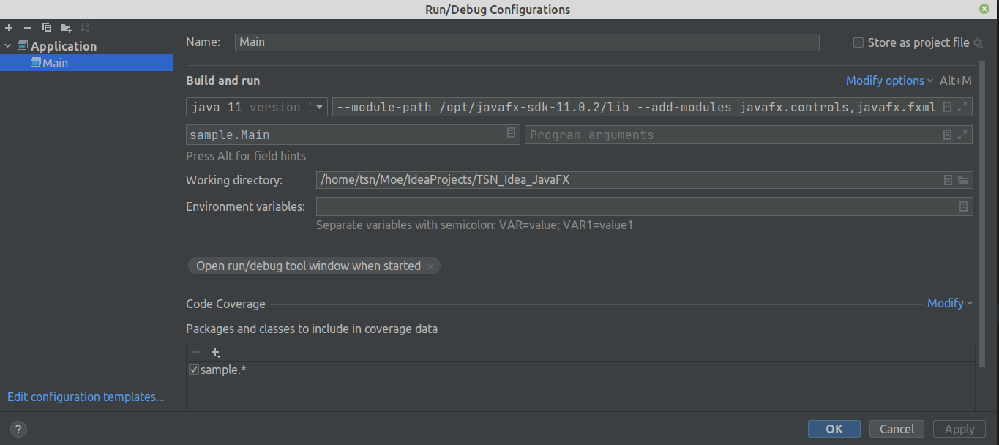

# TSN_Idea_JavaFX
Пример простейшего визуального приложения на JavaFX11 для IntelliJ IDEA на Java


```
java -jar --module-path /opt/javafx-sdk-11.0.2/lib --add-modules javafx.controls,javafx.fxml ./out/artifacts/JavaFxApplication_jar/JavaFxApplication.jar
```







```
--module-path /opt/javafx-sdk-11.0.2/lib --add-modules javafx.controls,javafx.fxml
```

JavaFX SDK: https://gluonhq.com/products/javafx/
